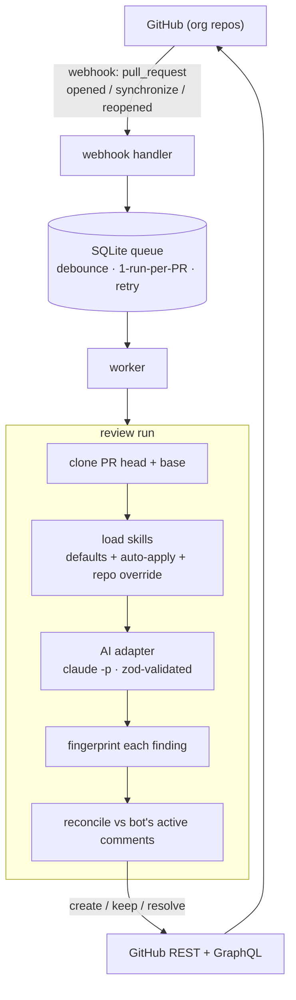

# mad-reviewer

> A self-hosted GitHub App that auto-reviews pull requests with a configurable AI tool, posts inline bug comments, and **remembers** — resolving its own comments when a bug is fixed and re-flagging it if it comes back.

[](https://github.com/deniscsz/mad-reviewer/actions/workflows/ci.yml)
[](https://deniscsz.github.io/mad-reviewer/)
[](https://nodejs.org)
[](./LICENSE)

📖 **Full documentation: https://deniscsz.github.io/mad-reviewer/**

---

## What it is

`mad-reviewer` runs as a single Node service. Install it as a GitHub App on your
org and every pull request gets reviewed automatically by an AI tool of your
choice (default: the `claude` CLI), guided by your own review **skills**. Each
bug becomes an inline review comment.

The differentiator is **memory**. On every run the agent reconciles against the
comments it left before:

- a finding still present → the comment is **kept** (no duplicate spam),
- a finding that disappeared (someone fixed it) → its comment is **resolved**
  automatically with a reply,
- a previously-resolved bug that reappears → a **fresh** comment.

There is no findings database. **GitHub is the source of truth** — the agent
recognizes its own comments by a fingerprint marker embedded in each comment
body. SQLite is used only for job orchestration.

## Architecture



Findings live in GitHub; SQLite holds only orchestration state.

## Features

- **Configurable AI adapter** — `claude -p` (default), `opencode run`, and
  `cursor-agent -p` ship built in; the adapter interface is swappable (more are
  easy to add).
- **3-tier skills** — always-on defaults, glob-selected auto-apply skills, and
  per-repo overrides committed in the reviewed repo itself.
- **Customizable persona (`SOUL.md`)** — tune the reviewer's voice (professional,
  sarcastic, …) with a project default, overridable per repo at
  `.mad-reviewer/SOUL.md`. Affects wording only, never what gets flagged.
- **Deterministic fingerprint dedup** — a bug keeps its identity across runs
  even when it moves lines, so comments are never duplicated.
- **Self-resolving comments** — fixed bugs get their threads resolved with a
  reply; reappearing bugs get re-flagged.
- **GitHub Check Run** — each review also publishes a check on the PR head:
  `success` when no comments remain open, `neutral` when any do (never blocks
  merge by default). Needs the `Checks: Read & write` App permission.
- **Inline + file-level fallback** — if a line anchor is invalid, it falls back
  to a file-level review comment that is still reconcilable.
- **Robust orchestration** — debounced, one run per PR, retry on failure,
  skips already-processed commits, and reclaims jobs after a crash/restart.
- **Safe by construction** — every subprocess goes through a single no-shell
  wrapper; PR-controlled values are never interpreted by a shell.

## How it works

1. A GitHub App webhook (`pull_request` opened/synchronize/reopened) hits the
   server, which enqueues a job in SQLite (debounced, one run per PR).
2. A worker clones the PR head, loads the effective skills, and runs the AI
   adapter to get a validated JSON list of bugs.
3. Each finding gets a deterministic fingerprint. The reconciler compares it
   against the bot's active comments (identified by an embedded fingerprint
   marker) and **creates / keeps / resolves** accordingly.

## Quick start

```bash
npm install
npm run build
npm start          # or: npm run dev
```

Health check: `GET /health` → `{"status":"ok"}`. Any other path returns
`404 {"error":"not_found"}`; webhooks live at `POST /api/github/webhooks`.

> **Requirements:** Node ≥ 22, `git` on the PATH, a configured **GitHub App**,
> and the chosen **AI CLI** (default `claude`) installed and authenticated in
> the runtime environment.
>
> The `.env` file is loaded by Node 22's native `--env-file` flag (already wired
> into the `dev`/`start` scripts). No `dotenv` dependency.

### Running locally against a real GitHub org

GitHub webhooks need a public URL. For local development, tunnel through
[smee.io](https://smee.io):

```bash
# in one terminal
npx smee-client --url https://smee.io/<channel> --target http://localhost:3000/api/github/webhooks

# in another terminal
npm run dev
```

Set the GitHub App's **Webhook URL** to `https://smee.io/<channel>`. The smee
client forwards every delivery to `localhost:3000/api/github/webhooks`.

## GitHub App setup

1. Create a GitHub App (org-level). **Permissions:**
   - Pull requests: **Read & write** (post/resolve comments)
   - Checks: **Read & write** (publish the per-PR check run)
   - Contents: **Read** (clone the PR)
   - Metadata: **Read**
2. **Subscribe** to the `Pull request` event.
3. Set the **Webhook URL** to your server (`/` path) and a **Webhook secret**.
4. Generate a **private key** and install the App on your org (covers all repos).
5. Copy `.env.example` to `.env` and fill in the credentials.

## Configuration

All configuration is via environment variables (parsed/validated in
[`src/config.ts`](./src/config.ts)).

| Variable | Required | Default | Description |
|---|---|---|---|
| `GITHUB_APP_ID` | ✅ | — | GitHub App ID |
| `GITHUB_PRIVATE_KEY` | ✅ | — | GitHub App private key (PEM) |
| `GITHUB_WEBHOOK_SECRET` | ✅ | — | Webhook HMAC secret |
| `MAD_REVIEWER_ADAPTER` | | `claude` | AI adapter to use: `claude`, `opencode`, or `cursor` |
| `MAD_REVIEWER_OPENCODE_MODEL` | | — | `opencode` only: `provider/model` for `--model` (unset → opencode default) |
| `MAD_REVIEWER_OPENCODE_CONFIG` | | `./opencode.review.json` | `opencode` only: trusted config defining the read-only `review` agent |
| `MAD_REVIEWER_CURSOR_MODEL` | | — | `cursor` only: model for `cursor-agent --model` (unset → Cursor default); needs `CURSOR_API_KEY` |
| `MAD_REVIEWER_LOAD_REPO_SKILLS` | | `true` | Load the reviewed repo's own native skills (`.claude/skills`, …) in addition to mad-reviewer's. Set `false` to ignore them |
| `MAD_REVIEWER_DEBUG` | | `false` | Verbose logging: emit full AI prompt + raw CLI output. Dev-only — may leak diff content |
| `MAD_REVIEWER_CHECKS` | | `true` | Publish a Check Run per review. Any value other than `false` keeps it on |
| `MAD_REVIEWER_CHECK_NAME` | | `mad-reviewer` | Name of the check (GitHub groups re-runs by name) |
| `AI_TIMEOUT_MS` | | `300000` | Per-run AI CLI timeout (ms) |
| `DEBOUNCE_MS` | | `15000` | Coalesce a burst of pushes before running (ms) |
| `MAX_RETRIES` | | `3` | Retries before a job is marked failed |
| `SQLITE_PATH` | | `./data/queue.db` | Orchestration DB path |
| `WORKER_POLL_MS` | | `2000` | Worker poll interval when idle (ms) |
| `PORT` | | `3000` | HTTP port |
| `DEFAULTS_DIR` | | `./skills/defaults` | Always-on skills directory |
| `AUTO_APPLY_DIR` | | `./skills/auto-apply` | Conditionally-applied skills directory |
| `SOUL_PATH` | | `./SOUL.md` | Project-default persona file (overridable per repo) |

## Skills

Skills are Markdown files that tell the AI what to look for and how to report
it. They are resolved in three tiers:

1. **`skills/defaults/`** — always loaded (`output-contract`, `null-safety`,
   `security`, …).
2. **`skills/auto-apply/`** — loaded only when a changed file matches the
   skill's `applies_to` globs (e.g. SQL rules for `**/*.sql`).
3. **`.mad-reviewer/skills/`** in the reviewed repo — overrides an *auto-apply*
   skill of the same name or adds a new one.

mad-reviewer's **defaults can never be overridden** by a repo (this includes
`output-contract.md`, which defines the JSON the adapter parses). Each finding
must carry a stable `dedupeKey` (`<category>:<symbol>:<symptom>`) — this, not the
line number, is what gives a bug its identity across runs.

### Your repo's own skills are honored too

mad-reviewer runs the AI provider (`claude -p` / `opencode run` /
`cursor-agent -p`) **inside the PR checkout**, so the same agent skills your
developers use day to day — the `.claude/skills/` (also `.agents/skills/`,
`.opencode/skill/`, `.cursor/rules/`) committed in the reviewed repo — are loaded
**natively** by the provider and inform the review, exactly as they would on a
developer's machine. No setup required; they must be in the standard
`<skill-name>/SKILL.md` layout.

These native skills *add* guidance on top of mad-reviewer's curated set but can
never override the output contract or the curated rules. To ignore them entirely
and review with only mad-reviewer's own skills (defaults + auto-apply +
`.mad-reviewer/skills/`), set `MAD_REVIEWER_LOAD_REPO_SKILLS=false`.

For safety, the reviewed repo's `.claude/settings.json`, `.mcp.json`,
`.cursor/mcp.json`, hooks and opencode plugins are **not** executed, and the
clone's embedded GitHub token is
stripped before the AI runs — an untrusted PR cannot run commands or exfiltrate
credentials.

> **Note on behavior:** when the agent auto-resolves a fixed bug it posts a
> short reply (currently in Portuguese, e.g. *"Resolvido automaticamente nesta
> revisão (commit …)"*). Adjust the string in
> [`src/github/comments.ts`](./src/github/comments.ts) if your audience differs.

## Persona (`SOUL.md`)

Skills decide *what* gets flagged; **`SOUL.md`** decides *how the reviewer talks*.
A project-default `SOUL.md` (path `SOUL_PATH`, default `./SOUL.md`) is injected into
the AI prompt to set the persona — professional, sarcastic, however you like — and
each reviewed repo can override it with its own `.mad-reviewer/SOUL.md`. The persona
shapes only the wording of findings; it never changes which bugs are reported or the
JSON output contract. Full guide:
**https://deniscsz.github.io/mad-reviewer/guide/soul**.

## Logging & debugging

Every meaningful step emits one JSON line on stdout:

```
{"event":"webhook","action":"synchronize","repo":"acme/api","pr":42,"headSha":"abc1234","installationId":7}
{"event":"enqueue","repo":"acme/api","pr":42,"headSha":"abc1234","runAfter":1737000015000}
{"event":"claim","repo":"acme/api","pr":42,"headSha":"abc1234"}
{"event":"job_start","repo":"acme/api","pr":42,"headSha":"abc1234"}
{"event":"comment_create","repo":"acme/api","pr":42,"file":"src/x.ts","line":12,"category":"null-safety","fp":"…"}
{"repo":"acme/api","pr":42,"sha":"abc1234","findings":3,"created":3,"kept":0,"resolved":0}
{"event":"job_done","repo":"acme/api","pr":42,"headSha":"abc1234","durationMs":4271}
{"event":"complete","repo":"acme/api","pr":42,"headSha":"abc1234"}
```

Set `MAD_REVIEWER_DEBUG=true` to also emit the full prompt and raw CLI output
on every AI run:

```
{"event":"ai_request","adapter":"cursor","model":"sonnet-4","args":["-p","--output-format","json"],"promptBytes":12834,"prompt":"…"}
{"event":"ai_response","adapter":"cursor","status":0,"stdoutBytes":4831,"stderrBytes":0,"stdout":"…","stderr":""}
```

> Debug logging embeds the PR diff in `prompt` and the raw model output in
> `stdout`. Keep it **off** in production unless your log sink can hold source
> code safely.

Filter examples (any `jq`-capable shell):

```bash
npm run dev 2>&1 | jq -c 'select(.event=="ai_response")'
npm run dev 2>&1 | jq -c 'select(.level=="error")'
```

See [Configuration → Logging](https://deniscsz.github.io/mad-reviewer/guide/configuration#logging)
for the full event catalogue.

## Docker

```bash
docker build -t mad-reviewer .
docker run --env-file .env -p 3000:3000 -v "$PWD/data:/data" mad-reviewer
```

The image installs `git`. You must also make the chosen **AI CLI** available in
the image (or a derived image) and provide its credentials via environment.

## Development

```
src/
  types.ts           # Finding zod schema + Job type
  fingerprint.ts     # deterministic bug identity + comment marker
  reconciler.ts      # create / keep / resolve decision logic
  skills/            # loader (3-tier) + auto-apply glob selection
  adapters/          # AiAdapter interface + claude, opencode & cursor adapters + parser
  github/comments.ts # list active bot comments, post inline, resolve thread
  github/checks.ts   # publish the per-PR check run (status + summary)
  queue/queue.ts     # SQLite orchestration queue
  workspace.ts       # clone PR head + diff (via safe subprocess wrapper)
  utils/             # execFileNoThrow (the only child_process user)
  runner.ts          # orchestrates one review run
  worker.ts          # drains the queue
  webhook.ts         # maps PR events to queue jobs
  config.ts          # env parsing/validation
  index.ts           # entrypoint: server + worker + /health
```

Scripts:

| Script | Purpose |
|---|---|
| `npm run dev` | Run the server with hot reload (`tsx`) |
| `npm run build` | Compile TypeScript to `dist/` |
| `npm start` | Run the compiled server |
| `npm test` | Run the test suite (vitest) |
| `npm run typecheck` | Type-check without emitting |
| `npm run docs:dev` | Run the documentation site locally |
| `npm run docs:build` | Build the documentation site |

The codebase is built test-first; the suite (vitest) covers the pure logic
(fingerprint, reconciler, skills, queue) and the IO modules via dependency
injection, so unit tests need no network or git.

```bash
npm test          # run all tests
npm run typecheck # type safety
```

## Documentation

The full guide — setup, configuration, the skills system, and a deep dive into
the architecture (reconciliation, queue, adapters) — lives at:

**https://deniscsz.github.io/mad-reviewer/**

## Contributing

Issues and PRs welcome. Please keep changes test-covered and run
`npm run typecheck && npm test` before opening a PR. See the
[Contributing guide](https://deniscsz.github.io/mad-reviewer/contributing).

## License

[MIT](./LICENSE) © 2026 Denis Spalenza
